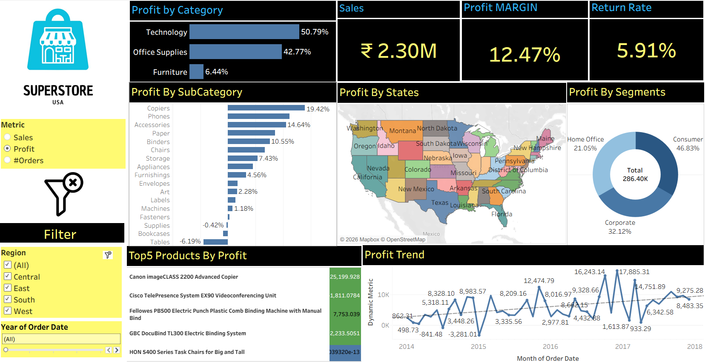

# Superstore Analysis 

## Objective 
The objective is to analyze this data and provide actionable, data-driven recommendations to guide Super Store.

## Dashboard Visualization 
 

## Key Insights 
* ## Overall Performance:
Sales: The Superstore generated ₹2.30 million in sales. Profit Margin: The overall profit margin is 12.47%. Return Rate: The return rate is 5.91%.

* ## Category Performance:
Data Analytics has the highest profit margin at 50.79%. Office Supplies has the highest sales volume. Furniture has the lowest profit margin.

* ## Sub-Category Performance:
Copiers and Accessories have the highest profit margins. Paper and Binders have the lowest profit margins.

* ## State Performance:
Home Office is the highest-performing segment. Corporate is the lowest-performing segment.

* ## Profit Trend:
The profit trend shows a general upward trend from 2014 to 2018, with a slight dip in 2015.

* ## Top 5 Products by Profit:
Canon imageCLASS 2200 Advanced Copier is the most profitable product.

## Additional Insights:
Region: The "West" region appears to be performing well based on the color-coded map. Year of Order Date: The dashboard allows for filtering by year to analyze performance over time.
